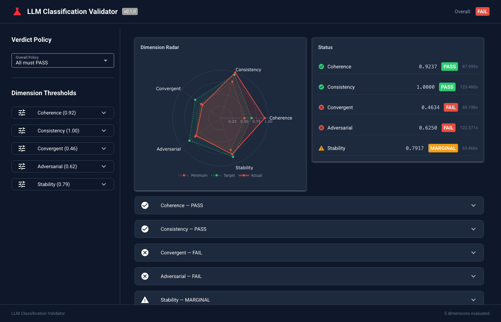
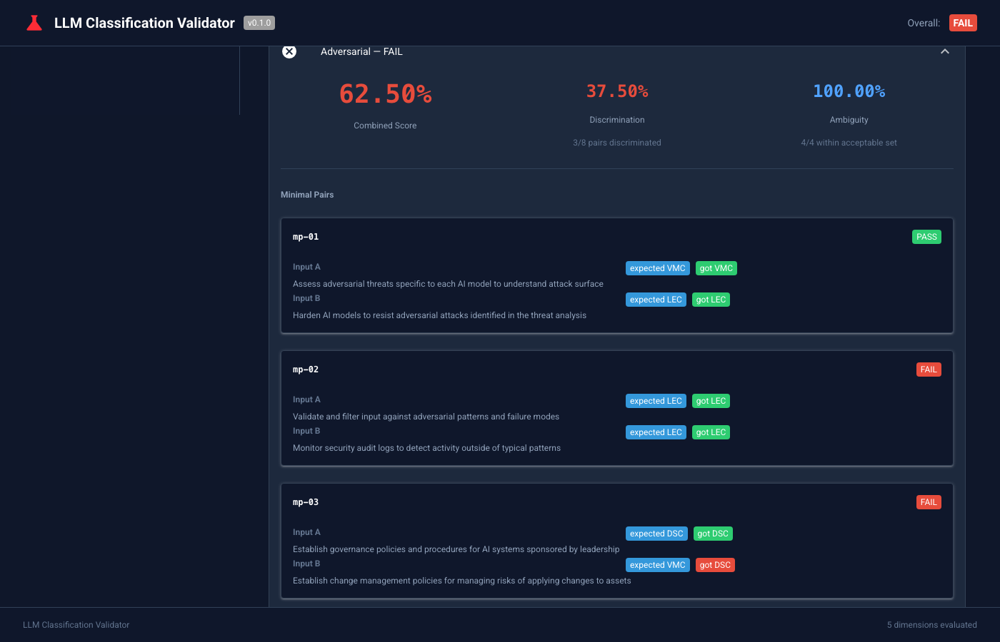

# LLM Classification Validator

[](https://creativecommons.org/licenses/by-nc-sa/4.0/)
[](https://www.python.org/downloads/)

The LLM classification validator is a five-dimension framework for testing LLM outputs. 

Companion blog post: [Validating LLM-Generated Control Mappings Beyond Aggregate Accuracy](https://cloudsecurityalliance.org/blog/2026/07/02/validating-llm-generated-control-mappings-beyond-aggregate-accuracy) (Cloud Security Alliance)

For a detailed explanation of the methodology, see [docs/METHODOLOGY.md](docs/METHODOLOGY.md).



## The five dimensions

1. **Coherence** — Do multiple runs (or multiple raters) agree? Inter-rater reliability via Cohen's kappa, Fleiss' kappa, and bootstrap confidence intervals.

2. **Consistency** — Do outputs satisfy structural and semantic rules? Checks that labels exist in the target taxonomy, hierarchies are internally consistent, and required fields are present.

3. **Convergent validity** — Does the LLM's mapping converge with an independently derived reference? Compares LLM labels against a transitive mapping through a third framework using kappa and Jaccard similarity.

4. **Adversarial discrimination** — Can the LLM tell similar things apart? Minimal pairs that differ in one critical dimension, plus ambiguous inputs with multiple acceptable answers.

5. **Stability and sensitivity** — Same input, same answer? Changed input, changed answer? Paraphrase invariance and perturbation sensitivity.

Each dimension produces a PASS / MARGINAL / FAIL verdict against configurable thresholds. An orchestrator consolidates all dimensions into a single evaluation report.

## Installation

```bash
pip install -e .

# With development dependencies:
pip install -e ".[dev]"
```

## Quick start

### Coherence

```python
from llm_classification_validator.coherence import run_coherence_analysis

raters = {
    "run_1": ["A", "B", "A", "C", "B"],
    "run_2": ["A", "B", "A", "C", "A"],
    "run_3": ["A", "B", "B", "C", "B"],
}
report = run_coherence_analysis(raters)
print(report.verdict)
```

### Consistency

```python
from llm_classification_validator.consistency import RuleRegistry, run_consistency_check
from llm_classification_validator.models import RuleResult

registry = RuleRegistry()

@registry.rule("R-001", "Label is non-empty", severity="error")
def label_present(item: dict) -> list[RuleResult]:
    passed = bool(item.get("label"))
    return [RuleResult(
        rule_id="R-001", rule_name="Label is non-empty",
        category="structural", severity="error",
        passed=passed, item_id=item.get("id"),
        message="OK" if passed else "Label missing",
    )]

items = [{"id": "1", "label": "A"}, {"id": "2", "label": ""}]
report = run_consistency_check(items, registry)
print(report.verdict)
```

### Convergent validity

```python
from llm_classification_validator.convergent import run_convergent_analysis

predicted = ["A", "B", "A", "C"]
reference = ["A", "B", "B", "C"]
report = run_convergent_analysis(predicted, reference)
print(report.verdict)
```

### Adversarial discrimination

```python
from llm_classification_validator.adversarial import MinimalPair, AmbiguityCase, run_adversarial_analysis

def my_classifier(text: str) -> str:
    return "category_A"

pairs = [MinimalPair("p1", "input alpha", "input beta", "A", "B")]
ambiguity = [AmbiguityCase("a1", "ambiguous input", ["A", "B"])]
report = run_adversarial_analysis(my_classifier, pairs, ambiguity)
```

### Stability

```python
from llm_classification_validator.stability import (
    ParaphraseVariant, PerturbationVariant, ExpectedDirection,
    run_stability_analysis,
)

base_items = {"item1": "original text", "item2": "other text"}

def classifier(text: str) -> dict[str, str]:
    return {"category": "A", "subcategory": "A.1"}

paraphrases = [
    ParaphraseVariant("item1", "item1_p1", "formal", "the original text, formally"),
]
report = run_stability_analysis(base_items, classifier, paraphrases=paraphrases)
```

### Full evaluation

Pass dimension runners (zero-argument callables returning `DimensionReport`) to the orchestrator:

```python
from llm_classification_validator.runner import run_evaluation

def my_coherence_runner():
    return run_coherence_analysis(...)

def my_consistency_runner():
    return run_consistency_check(...)

report = run_evaluation(
    foundation=[my_coherence_runner, my_consistency_runner],
    advanced=[my_adversarial_runner, my_stability_runner],
    parallel_advanced=True,
)
print(report.overall_verdict)
print(report.summary)
```

See `examples/aicm_to_faircam.py` for a complete working example using real CSA AI Controls Matrix controls. The AICM-to-FAIR-CAM mappings are illustrative — replace with your own taxonomy pair.

## Configuration

All thresholds, bootstrap parameters, sampling settings, and runner options are configurable via YAML or Python.

Copy `eval_config.yaml` and override what you need:

```yaml
coherence:
  thresholds:
    - metric: mean_kappa
      target: 0.80
      minimum: 0.60
  bootstrap:
    iterations: 5000
    confidence: 0.95

adversarial:
  discrimination_target: 0.90

sampling:
  min_per_stratum: 5
  min_total: 30
```

```python
from llm_classification_validator.config import EvalConfig

config = EvalConfig.from_yaml("eval_config.yaml")
```

See `eval_config.yaml` for all available options with defaults.

## Statistical methods

All computations use the standard library only and following statistical methods:

- **Cohen's kappa**: two-rater categorical agreement
- **Fleiss' kappa**: multi-rater categorical agreement
- **Jaccard similarity**: set overlap
- **Bootstrap confidence intervals**: percentile method, configurable iterations and seed
- **PASS / MARGINAL / FAIL verdicts**: threshold-based with target and minimum levels

## UI

The validation dashboard provides:

- Dimension radar chart comparing actual scores against target and minimum thresholds
- Configurable thresholds per dimension with live verdict recalculation
- Per-control issue view aggregating problems across all dimensions
- Adversarial detail panel showing minimal pair results

```bash
# Requires UI dependencies
pip install -e ".[ui]"

# Run the dashboard
PYTHONPATH=. python examples/run_ui.py
```



## Tests

111 tests across 8 test files, all using standard library only.

```bash
pip install -e ".[dev]"
pytest
```

## License

CC BY-NC-SA 4.0
