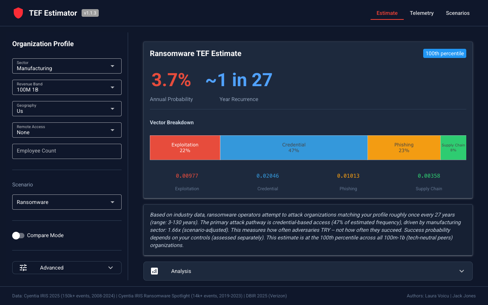
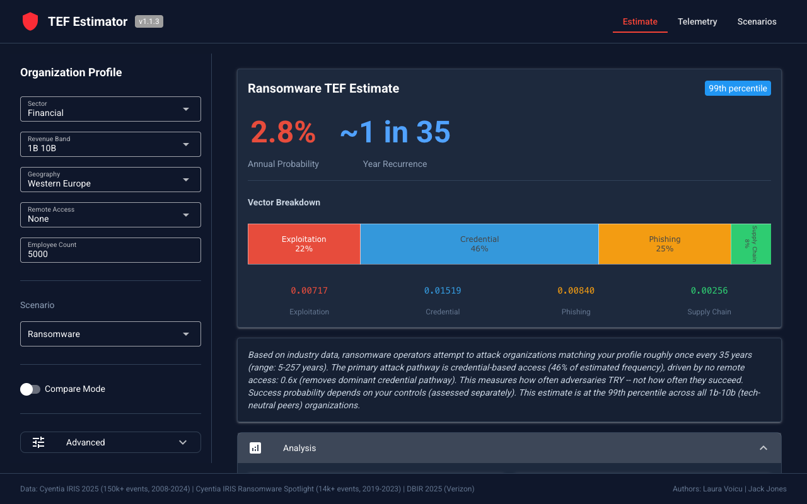
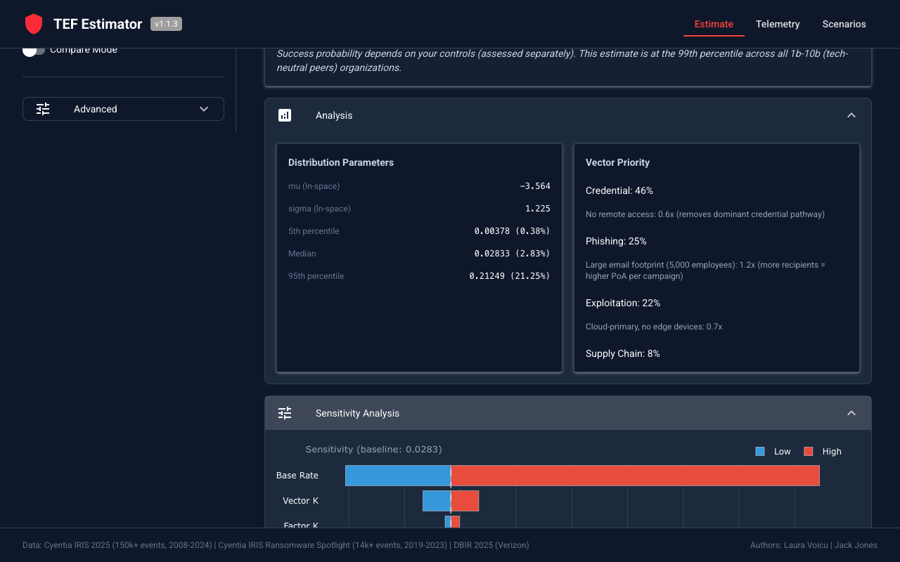
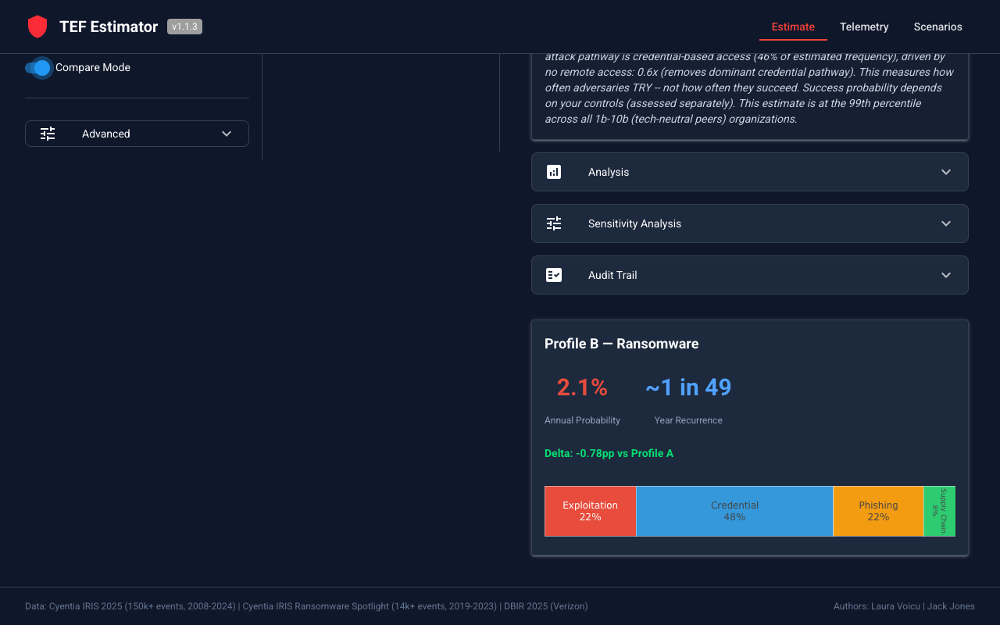
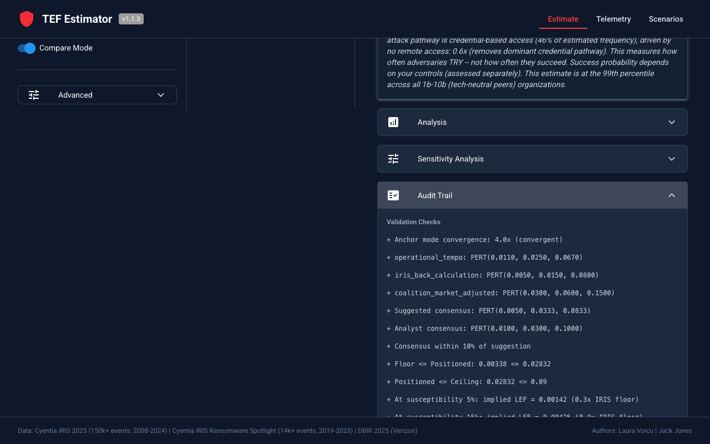

# TEF Estimator

[](https://pypi.org/project/tef-estimator/)
[](https://creativecommons.org/licenses/by-nc-sa/4.0/)
[](https://www.python.org/downloads/)
[](https://www.fairinstitute.org/)

**Important:** This is an independent implementation of TEF estimation for the FAIR methodology. See [FAIR_NOTICE.md](FAIR_NOTICE.md) for trademark information, data sources, and attributions.

Data-grounded Threat Event Frequency estimation with vector decomposition and multi-scenario support.

Produces defensible TEF estimates for cyber risk quantification by decomposing threat frequency into four initial access vectors (exploitation, credential, phishing, supply chain), each with independent data sources and floor/ceiling bounds. Currently supports **ransomware**, **business email compromise (BEC)**, and **custom analyst-defined** scenarios.

See [docs/user-guide.md](docs/user-guide.md) for methodology details, [docs/technical-reference.md](docs/technical-reference.md) for the full specification, and [docs/api-reference.md](docs/api-reference.md) for CLI and Python API.

## Authors

Laura Voicu and Jack Jones.

## Web UI



The web interface provides live estimation with sidebar profile inputs, vector breakdown charts, and natural-language interpretation. Additional panels expand inline:

| Feature | Description |
|---------|-------------|
| **Analysis** | Distribution parameters (lognormal mu/sigma, percentiles) and vector priority ranking with multiplier explanations |
| **Sensitivity Analysis** | Tornado chart showing which parameters drive the estimate most |
| **Compare Mode** | Side-by-side estimation for two organization profiles with delta |
| **Audit Trail** | Full validation checks, anchor convergence, floor/ceiling bounds |

<details>
<summary>More screenshots</summary>

**Analysis & Sensitivity**


**Sensitivity tornado chart**


**Compare Mode**


**Audit Trail**


</details>

## Installation

From [PyPI](https://pypi.org/project/tef-estimator/):

```bash
pip install tef-estimator
```

With optional extras:

```bash
pip install tef-estimator[ui]          # Web interface (NiceGUI)
pip install tef-estimator[telemetry]   # Continuous monitoring (requests)
pip install tef-estimator[viz]         # Charts (matplotlib, plotly)
pip install tef-estimator[all]         # Everything
```

Or from source:

```bash
git clone https://github.com/security-decision-science/tef-estimator.git
cd tef-estimator
pip install -e ".[dev]"
```

Requires Python 3.10+. All reference data ships with the package — no external API keys or accounts needed.

## Quick Start

### Python API

```python
from tef_estimator.engine import TEFEngine
from tef_estimator.profile import OrganizationProfile
from tef_estimator.data.common import Sector, RevenueBand, Geography, RemoteAccessType
from tef_estimator.data.scenarios.ransomware import RansomwareScenario
from tef_estimator.data.scenarios.bec import BECScenario

profile = OrganizationProfile(
    sector=Sector.MANUFACTURING,
    revenue_band=RevenueBand.R_100M_1B,
    geography=Geography.US,
    remote_access=[RemoteAccessType.FORTINET],
    employee_count=2000,
)

# Ransomware estimate
result = TEFEngine(scenario=RansomwareScenario()).estimate(profile)
print(result.brief_report())

# BEC estimate (same profile, different scenario)
bec_result = TEFEngine(scenario=BECScenario()).estimate(profile)
print(bec_result.brief_report())
```

### Continuous Telemetry Monitoring

```bash
pip install tef-estimator[telemetry]
tef-estimator telemetry init
tef-estimator telemetry collect --force
tef-estimator telemetry baseline
tef-estimator telemetry compare
tef-estimator telemetry watch --interval 60
```

Collects from 7 sources: 5 live public APIs (DShield, CISA KEV, Ransomware.live, GreyNoise, annual report edition monitor) plus 2 bundled reference data importers (IRIS reference data, initial access vector benchmarks from DBIR/Unit42/Mandiant/Beazley/CrowdStrike/IBM). Integrates into rolling averages, compares against a stored baseline, and re-estimates TEF when significant shifts are detected. Requires `requests`.

### Web UI

```bash
pip install tef-estimator[ui]
tef-estimator ui
```

Opens a browser-based interface with sidebar profile inputs, live estimation, vector breakdown and tornado sensitivity charts, and compare mode. Dark Material Design theme via NiceGUI.

### CLI

```bash
# Ransomware TEF estimate
tef-estimator estimate --sector manufacturing --revenue 100m_1b --geo us \
    --remote-access fortinet --employees 2000

# BEC estimate
tef-estimator estimate --sector financial --revenue 100m_1b --geo us \
    --scenario bec

# Full calculation trace
tef-estimator explain --sector manufacturing --revenue 100m_1b --geo us

# Export to markdown file
tef-estimator estimate --sector manufacturing --revenue 100m_1b --geo us -o report.md

# Compare two profiles
tef-estimator compare \
    --sector manufacturing --revenue 100m_1b --geo us --remote-access fortinet \
    --b-sector manufacturing --b-revenue 100m_1b --b-geo us --b-remote-access none

# Sensitivity analysis
tef-estimator sensitivity --sector manufacturing --revenue 100m_1b --geo us

# Inspect embedded data
tef-estimator data multipliers
tef-estimator data base-rate --scenario bec
tef-estimator data vectors --scenario ransomware
```

## How It Works

### Three-Layer Estimation

Each vector estimate is bounded by three layers:

1. **Floor** (observed LEF) -- IRIS 2025 observed loss event frequencies by sector and revenue band. Since TEF >= LEF by definition, these are a logical minimum.
2. **Ceiling** (campaign-level contact frequency) -- derived from DShield scanning telemetry (exploitation) and operational tempo data (credential). Confirms constant bombardment but doesn't constrain the estimate.
3. **Positioned estimate** (base rate x profile multipliers) -- a triangulated base rate adjusted by sector, revenue band, technology exposure, and geography. The positioned estimate sits between floor and ceiling.

### Vector Decomposition

Total TEF is decomposed into four initial access vectors, each estimated independently:

| Vector | Ransomware Share | BEC Share | Primary Data |
|--------|:---:|:---:|------|
| Exploitation | ~20-25% | ~3% | DShield scanning, CISA KEV, EPSS |
| Credential | ~50-55% | ~22% | Operational tempo, IAB market data |
| Phishing | ~15-20% | ~65% | Anti-phishing vendor reports |
| Supply chain | ~5-8% | ~10% | IR report third-party involvement rate |

Vectors are summed with cross-vector dampening (k=0.85, empirically supported by VERIS analysis of 10,037 incidents).

### Credibility Blending and Posterior Band Contraction

When organization-specific telemetry is provided (per-vector observed attempt rates, observation periods, detection coverage), the engine blends the population-level prior with the org's own data using Bühlmann credibility weighting. The point estimate shifts toward the observed rate proportional to the credibility weight Z = n/(n+k).

The uncertainty band contracts via a Gamma-inspired mechanism: the PERT-derived band width is treated as a Gamma prior whose shape α is fit to the elicited range, then updated with observed pseudo-events. More observation periods produce a monotonically tighter output distribution. At zero telemetry, the band equals the prior. The mechanism uses two separately calibrated parameters (k for the mean, α_pert from the PERT range for the band) rather than a single Bayesian model. See `docs/technical-reference.md` §8.6 for the full derivation and known limitations.

### Three-Anchor Base Rate Triangulation

Each scenario's base rate is triangulated from three independent anchors:

1. **Operational tempo** -- active groups x campaigns x targets / addressable population
2. **IRIS back-calculation** -- observed LEF / susceptibility prior
3. **Insurer market-adjusted** -- claims frequency with bias correction

The consensus PERT is computed as the arithmetic mean of anchor modes, bounded by the minimum anchor low and a capped anchor high. A convergence check validates that all anchors are within an order of magnitude. The full triangulation derivation appears in the audit trail (`result.full_report()` or `--full`).

## Output Tiers

| Tier | Method | Content |
|------|--------|---------|
| **Tier 1** (summary) | `result.brief_report()` or `--brief` | Annual probability, recurrence interval, vector bar chart, one sentence, peer percentile |
| **Tier 2** (analysis) | Default CLI output | Tier 1 + distribution parameters, sensitivity, per-vector ranges |
| **Tier 3** (audit) | `result.full_report()` or `--full` | Complete calculation traces, validation checks, triangulation derivation, data sources, warnings |
| **JSON** | `result.to_dict()` or `--json` | All three tiers as structured data |
| **Markdown** | `result.to_markdown()` or `--output file.md` | Structured markdown with tables, traces, and sources — suitable for reports |

## Data Sources

All empirical parameters are loaded from bundled JSON files under `data/reference/` with source citations. Nothing is hardcoded in the engine.

| Source | What It Feeds |
|--------|---------------|
| IRIS 2025 (Cyentia) | Sector/revenue multipliers, floor anchors, ransomware shares |
| DBIR 2025/2026 (Verizon) | Vector proportions, third-party rates |
| Unit 42 IR 2025/2026 (Palo Alto) | Vector proportions (500-750 engagements) |
| M-Trends 2026 (Mandiant) | Exploit dominance, vishing emergence |
| CrowdStrike GTR 2026 | Credential proxy indicators, edge device targeting |
| Beazley Q3 2025 | VPN credential proportion, RDP initial access |
| IBM CODB 2025 | Vector proportions (600 organizations) |
| Coalition 2025 | Claims frequency, bias correction anchor |
| FBI IC3 2024 | BEC operational tempo, sector targeting |
| CISA KEV | Exploitation floor (unpatched CVEs) |
| DShield / SANS ISC | Exploitation ceiling (scanning telemetry) |
| EPSS (Cyentia) | Exploitation positioning |
| Ransomware.live | Operational tempo (victim claim counts) |
| VERIS / VCDB | Dampening coefficient empirical support |

### Data Refresh

Reference data ships with the package. To update, replace the `extracted.json` files under `src/tef_estimator/data/reference/`. The `tef-estimator refresh check` command validates data freshness:

```bash
tef-estimator refresh check      # Validate data freshness (reports per-source age and staleness warnings)
```

Data freshness warnings also appear automatically in estimation output when any source is >90 days old.

## Scenarios

Scenarios are pluggable data definitions under `tef_estimator/data/scenarios/`. The engine is scenario-agnostic -- adding a new scenario requires only a JSON data file and a Python class implementing `ScenarioDefinition`.

| Scenario | Slug | Typical TEF (mid-market, US) |
|----------|------|------|
| Ransomware | `ransomware` | ~0.7% (~1 in 146 years) |
| Business Email Compromise | `bec` | ~14.9% (~1 in 7 years) |
| Custom | user-defined | varies |

Custom scenarios are defined as JSON files specifying vector proportions across the four initial access vectors (exploitation, credential, phishing, supply chain), a base rate, and an overall incident share. Generate a template with `tef-estimator scenario template`, or use the visual builder in the web UI's Scenarios tab. See `docs/user-guide.md` for the full JSON spec.

## Limitations

- **The base rate is the weakest link.** Despite three-anchor triangulation, all three anchors have wide uncertainty bands. The base rate drives the output more than any multiplier.
- **The floor is too low.** IRIS observed LEF captures only publicly disclosed events. The disclosure gap varies by cohort.
- **Cross-vector dampening is a judgment call.** k=0.85 is empirically supported by VERIS co-occurrence analysis (credential x phishing lift=8.3, exploitation independent at lift~0.2), but the bimodal structure means a single k is a simplification.
- **BEC sector/revenue data is less granular than ransomware.** IRIS does not publish BEC-specific breakdowns; BEC shares are derived from FBI IC3 and the DBIR.
- **TEF is non-stationary.** Output is labelled point-in-time; refresh on a regular basis (quarterly recommended).
- **This estimates how often adversaries TRY, not how often they succeed.** Success probability depends on controls (which should beassessed separately).

## License

Code and data in this repository are released under the Creative Commons Attribution-NonCommercial-ShareAlike 4.0 International License (CC BY-NC-SA 4.0). See [LICENSE](LICENSE) and [FAIR_NOTICE.md](FAIR_NOTICE.md).
